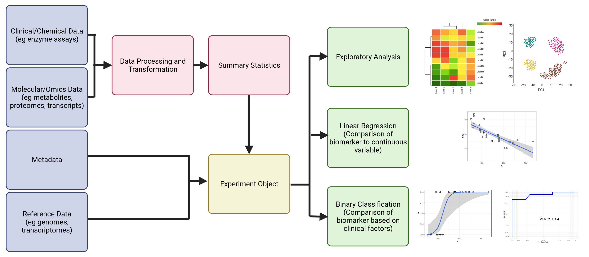
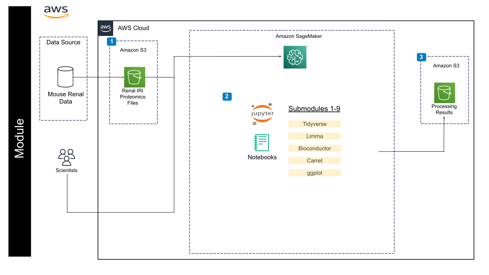

## Contents

+ [Overview](#overview)
+ [Getting Started](#getting-started)
+ [Software Requirements](#software-requirements)
+ [Creating a notebook instance](#creating-notebook-instance)
+ [Running Tutorial Files](#running-tutorial-files)
+ [Workflow](#workflow)
+ [Troubleshooting](#troubleshooting)


The data used in this module is stored in an AWS S3 bucket and does require using `aws s3 cp` command to download the data sets.  R packages used will be downloaded from within each notebook.

## Overview

This repository contains files comprising a learning module covering concepts in biomarker discovery. The learning module consists of 9 submodules, with each submodule consisting of a Jupyter Notebook running the R programming language.  We assume the user has a basic knowledge of R and the R Bioconductor suite, but this is not required.  The submodules are organized as follows:

+ **Submodule 1: Introduction to Biomarkers** - Define what biomarkers are, identify the types of biomarkers, define properties of biomarkers that make them clinically useful, explore case studies of common clinical biomarkers.  
+ **Submodule 2: Introduction to R Data Structures** - (Optional).  
+ **Submodule 3: Introduction to Linear Models** - (Optional).  
+ **Submodule 4: Principles of Exploratory Analysis** - (Optional).  
**Submodule 5: Rat Renal Ischaemia Reperfusion Injury Case Study** - Introduce the mouse renal IRI model used in this module.  
+ **Submodule 6: Linear and Logistic Regression for Comparison of Quantitative Biomarkers** - Compare two known clinical biomarkers using linear regression to identify state changes, Compare two biomarkers using binary classification schemes using logistic regression, evaluate classification schemes using ROC curves.  
+ **Submodule 7: Exploratory Analysis of Proteomics IRI Data** - Normalize proteomics data for further analysis, identify and correct for batch effects in the data, explore trends in the data using dimensionality reduction methods such as principle components analysis, plot proteomics data using heatmaps.  
+ **Submodule 8: Identification of IRI Biomarkers from Proteomic Data** - Perform differential analysis on proteomic data to identify potential biomarkers indicating state changes.  
+ **Submodule 9: Machine Learning Methods in Biomarker Discovery** - Explore basic machine learning methods using the IRI proteomics data.  

Submodules 2-4 cover optional background material for learners who need it and may be skipped for those who don't.

## Getting Started

This learning module will introduce the user to basic concepts in biomarker discovery that the user is likely to encounter in the clinical and biomedical literature.  The   motivating factor behind the design of this module is that is to bridge the gap between how bioinformaticians and clinicians view biomarker data.  The bioinformatician typically takes a bird's eye view of the data, looking for global patterns that indicate statistically and biologically significant changes of state, whereas the clinician is motivated by more practical concerns such as cost, accuracy, specificity and clinical utility of potential biomarkers.  The field of biomarker discovery is complex and ever changing and it is not possible to cover every possible method and technique currently employed in clinical research.  As such, we will focus on common methods such as exploratory analysis (PCA, heatmaps, etc.), linear regression for comparison of biomarkers and analysis of omics data, logistic regression for binary classification schemes involving biomarkers, and machine learning for biomarker discovery.

## Software Requirements

This module employs Jupyter Notebooks running R 4.2 using Bioconductor for bioinformatics data analysis and will employ tidy data principles implemented by the *tidyverse* package.  A basic knowledge of R is expected but not required for completing the module. Submodule 02 will review R data structures that will be particularly relevant in regression analysis.  Required R packages will be installed within each submodule.  The installation can take several minutes the first time the packages are installed.  Key packages used include *tidyverse* and BioConductor packages such as *limma*.  Prior understanding of these packages is not required to complete this module but users are encouraged to learn more about these packages prior to or following completion of this module to better understand the commands used.

Jupyter Notebooks are run through your browser and have the file extension *ipynb*.  Activate the notebook by double-clicking the file name and it will automatically open in your browser. Each notebook consists of markdown and code cells.  Markdown cells are for text and figures and are there to guide you through the chapters.  Code cells can be run by clicking the play arrow at the top of the screen or by hitting CTRL-ENTER.  The code will run within the notebook and generate the appropriate output.  You may freely change the code and re-run the block as often as you like.  This is useful if you want to test different analysis models or modify figures. 

## Creating a notebook instance 

Follow the steps highlighted [here](https://github.com/NIGMS/NIGMS-Sandbox/blob/main/docs/HowToCreateAWSSagemakerNotebooks.md) to create a new notebook instance in Amazon SageMaker. 

+ In step 4, select ml.m5.xlarge from the dropdown box as the notebook instance type and be especially careful to **enable idle shutdown**.

+ In step 7, after creating a notebook instance and being in JupyterLab screen you will need to download the module content. The easiest way to do this is to clone the repository directly for the NIGMS Github. This can be done by clicking on git symbol in your JupyterLab environment and pasting the following URL `https://github.com/NIGMS/Analysis-of-Biomedical-Data-for-Biomarker-Discovery.git`. This should download our repo, and the tutorial files inside, into a folder called 'Analysis-of-Biomedical-Data-for-Biomarker-Discovery'. Double click this folder now. Inside you will find all of the tutorial files, which you can double click and run. You should also see a data file that contains the biomarker and proteomic data to be analyzed.

+ In step 8, you select a Kernel for the notebook. Please select R for this module. 

+ When you are finished running code, stop your notebook to prevent unneeded billing as illustrated in step 9.

## Running Tutorial Files

All of the tutorial workflows in this module are Jupyter format. To run them, double click the tutorial file you want.

This will open the file in Jupyter notebook. From here you can run each section, or 'cell', of the code, one by one, by pushing the 'Play' button on the above menu or by hitting CTRL-ENTER (make sure your cursor is in the code block you want to run). Code blocks run in the order you click them, and a common source of errors is running code out of order (i.e. a code block is dependent another block of code to be run first).

Some 'cells' of code take longer for the computer to process than others. You will know a cell is running when a cell has an asterisk next to it \[\*\]. When the cell finishes running, that asterisk will be replaced with a number which represents the order that cell was run in.  In most cases, it takes only a few seconds for code to run, but some steps (such as package installation) may take several minutes.  If you try to run two or more code blocks at the same time, the code blocks will run sequentially in the order you executed them.

You can now explore the tutorials by running the code in each, from top to bottom. Look at the 'workflows' section below for a short description of each tutorial.

Jupyter is a powerful tool, with many useful features. For more information on how to use Jupyter, we recommend searching for Jupyter tutorials and literature online.


## Workflow


Below is the general workflow and AWS architecture of the module. We start by creating our experimental object (in our case, an R list data structure) from processed biomarker and proteomic data.  We then add metadata (i.e., data about the samples) and optional additional data (e.g. genome and annotation files, if we were using transcriptome data) appropriate to the experiment.  We can will save this object and reload it, add to it, and save it in subsequent notebooks.  It's important to run the notebooks in order to ensure that the experimental object is properly updated.  The next step will be analysis of known clinical biomarkers to each other using linear and logistic regression methods common in the clinical literature.  Once these methods are learned using known biomarkers, they can then be applied to newly discovered potential biomarkers. The next two notebooks will cover exploratory and differential analysis of proteomics data to identify new potential biomarkers.  We will look at how to normalize proteomics data, how batch effects can complicate data analysis and how to correct for them, and how to identify potential biomarkers by identifying proteins whose expression differs significantly between healthy and injured states. The final notebooks will cover background information on R data structures, the use of linear models in bioinformatics data analysis, principles of exploratory analysis, and how the methods covered in this module can be extended to machine learning methods for automated biomarker discovery.




## Troubleshooting

R packages, particularly those from BioConductor, often have many dependencies (i.e., other required packages they depend on to run).  This means that the first time you install these packages, it could take several minutes for everything to install. **Please don't assume the notebook has locked up!!!**  When a code block is running, an asterisk (\*) will appear in brackets to the left of the code box.  This indicates the code box is currently executing code.  Once it has completed, the asterisk will be replaced by a number indicating the order of commands.  Most of the code boxes should run very quickly.  You can execute multiple code blocks at the same time, but they will run in the order that you input them.  If a code block is taking longer to run than you expect, it may be waiting on another code block to finish executing.

If you get an error during package installation, it could be that R is trying to install a version of the package that is not compatible with the version of R you are using.  When you create your VM's to run this module, always use the latest version of R available (4.2 at the time of this writing).  Another common error is that a code block fails because the required package wasn't loaded.  All packages are loaded at the top of the notebook so double check that there are no errors there.

Necessary R packages will be loaded in each submodule.  When we begin working with experimental data, we will build an experimental object which will be reloaded and extended in later modules.  It's important that submodules 5-9 be run in order (at least the first time) to ensure that the experimental data is loading correctly. 

## Bedrock (Optional)

Generative AI is available for this tutorial if you would like to use it. To run it, please reference Submodule 1, or run the following code within a submodule notebook.

```!pip install -q ipywidgets
import sys
import os
util_path = os.path.join(os.getcwd(), 'util')
if util_path not in sys.path:
    sys.path.append(util_path)

# Import the display_widgets function from your Python file
from genai import display_widgets

# Call the function to display the widgets
display_widgets()