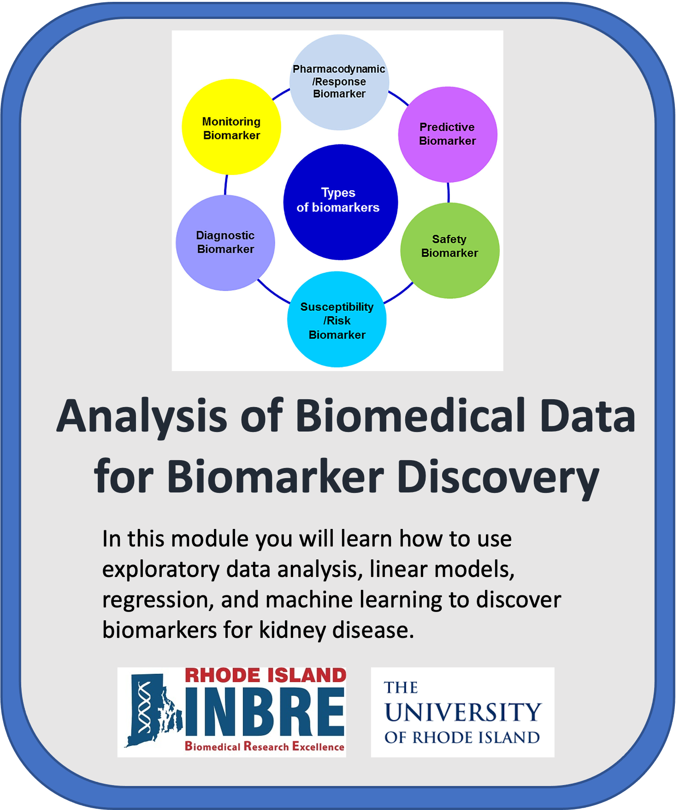

# Analysis of Biomedical Data for Biomarker Discovery
## Dr. Christopher L. Hemme
## Director, [RI-INBRE Molecular Informatics Core](https://web.uri.edu/riinbre/mic/)
## The University of Rhode Island College of Pharmacy

 

    

Image from https://doi.org/10.3389/fpsyt.2020.00432

## Contents

+ [Introduction](#introduction)
+ [Overview](#overview)
+ [Software Requirements](#software-requirements)
+ [Data](#data)
+ [Funding](#funding)
+ [License for Data](#license-for-data)

## Introduction

Welcome to the cloud-based learning module **Analysis of Biomedical Data for Biomarker Discovery** presented by the [Rhode Island INBRE Molecular Informatics Core (MIC)](https://web.uri.edu/riinbre/mic/) at the University of Rhode Island.  The module was developed by Dr. Christopher L. Hemme, Director of the MIC using data from Dr. Nisanne Ghonem at the Department of Biomedical and Pharmaceutical Sciences, College of Pharmacy, University of Rhode Island.  Our goal with this module is to bridge the gap between bioinformaticians (particularly those from a non-clinical background) and clinicians or clincal researchers who often view the same biomedical data in very different ways.  For example, bioinformaticians may not be familiar with the conventions for data presentation and visualization in the clinical literature, while clinicians are often overwhelmed by the volumes of data generated by modern bioinformatics methods or may question the utility of the results of bioinformatics analyses compared to more traditional clinical methods.  We present this challenge in terms of clinical biomarker discovery, that is, biological measures of health and disease.  For the clinician, a biomarker must be cheap and easy to measure, accurate, and easily interpretable for both the clinician and the patient.  A bioinformatician, on the other hand, is often looking at biomarkers on a global scale, trying to identify multiple correlated biomarkers that may or may not be obvious clinical targets.  Understanding the basic principles behind biomarker discovery and analysis will help these two groups better communicate when it comes time for data analysis and publication.

This module offers two computing pathways: [AWS (Amazon Web Services)](https://github.com/NIGMS/Analysis-of-Biomedical-Data-for-Biomarker-Discovery/tree/master/AWS) or [GCP (Google Cloud Platform)](https://github.com/NIGMS/Analysis-of-Biomedical-Data-for-Biomarker-Discovery/tree/master/GoogleCloud). Users can choose their preferred cloud service to run the Jupyter notebooks, ensuring flexibilty and accessibilty based on their existing infrastructure or familairty. Detailed instructions for setting up and using either AWS or GCP for this module are provided within their corresponding folders within this repository.
This module will cost about $1.00 to run, assuming you shut down and delete all resources when you are finished.

Watch this [Introduction Video](https://youtu.be/THy_d33Ih6M) to learn more about the module.

## Overview

This repository contains files comprising a learning module covering concepts in biomarker discovery. The learning module consists of 9 submodules, with each submodule consisting of a Jupyter Notebook running the R programming language.  We assume the user has a basic knowledge of R and the R Bioconductor suite, but this is not required.  The submodules are organized as follows:

+ **Submodule 1: Introduction to Biomarkers** - Define what biomarkers are, identify the types of biomarkers, define properties of biomarkers that make them clinically useful, explore case studies of common clinical biomarkers.  
+ **Submodule 2: Introduction to R Data Structures** - (Optional).  
+ **Submodule 3: Introduction to Linear Models** - (Optional).  
+ **Submodule 4: Principles of Exploratory Analysis** - (Optional).  
+ **Submodule 5: Rat Renal Ischaemia Reperfusion Injury Case Study** - Introduce the mouse renal IRI model used in this module.  
+ **Submodule 6: Linear and Logistic Regression for Comparison of Quantitative Biomarkers** - Compare two known clinical biomarkers using linear regression to identify state changes, Compare two biomarkers using binary classification schemes using logistic regression, evaluate classification schemes using ROC curves.  
+ **Submodule 7: Exploratory Analysis of Proteomics IRI Data** - Normalize proteomics data for further analysis, identify and correct for batch effects in the data, explore trends in the data using dimensionality reduction methods such as principle components analysis, plot proteomics data using heatmaps.  
+ **Submodule 8: Identification of IRI Biomarkers from Proteomic Data** - Perform differential analysis on proteomic data to identify potential biomarkers indicating state changes.  
+ **Submodule 9: Machine Learning Methods in Biomarker Discovery** - Explore basic machine learning methods using the IRI proteomics data.  

Submodules 2-4 cover optional background material for learners who need it and may be skipped for those who don't.

## Software Requirements

This module employs Jupyter Notebooks running R 4.2 using Bioconductor for bioinformatics data analysis and will employ tidy data principles implemented by the *tidyverse* package.  A basic knowledge of R is expected but not required for completing the module. Submodule 02 will review R data structures that will be particularly relevant in regression analysis.  Required R packages will be installed within each submodule.  The installation can take several minutes the first time the packages are installed.  Key packages used include *tidyverse* and BioConductor packages such as *limma*.  Prior understanding of these packages is not required to complete this module but users are encouraged to learn more about these packages prior to or following completion of this module to better understand the commands used.

Jupyter Notebooks are run through your browser and have the file extension *ipynb*.  Activate the notebook by double-clicking the file name and it will automatically open in your browser. Each notebook consists of markdown and code cells.  Markdown cells are for text and figures and are there to guide you through the chapters.  Code cells can be run by clicking the play arrow at the top of the screen or by hitting CTRL-ENTER.  The code will run within the notebook and generate the appropriate output.  You may freely change the code and re-run the block as often as you like.  This is useful if you want to test different analysis models or modify figures. 

## Data

These tutorials use example sequence data procured from the laboratory of Dr. Nisanne Ghonem at the Department of Biomedical and Pharmaceutical Sciences, College of Pharmacy, University of Rhode Island. The relevant manuscripts can be found [here](https://pubmed.ncbi.nlm.nih.gov/34328097/) and [here](https://pubmed.ncbi.nlm.nih.gov/34560548/).

## Funding

This module was funded through an administrative supplement to the Rhode Island IDeA Network of Biomedical Research Excellence (RI-INBRE) from the National Institute of General Medical Sciences of the National Institutes of Health under grant number P20GM103430 (RI-INBRE).

## License for Data

Text and materials are licensed under a Creative Commons CC-BY-NC-SA license. The license allows you to copy, remix and redistribute any of our publicly available materials, under the condition that you attribute the work (details in the license) and do not make profits from it. More information is available [here](https://tilburgsciencehub.com/about).

This work is licensed under a [Creative Commons Attribution-NonCommercial-ShareAlike 4.0 International License](http://creativecommons.org/licenses/by-nc-sa/4.0/)

## Table of Contents
### AWS
[README](https://github.com/NIGMS/Analysis-of-Biomedical-Data-for-Biomarker-Discovery/blob/master/AWS/README.md)  
**Submodule01 Biomarker Concepts**: [Overview](https://github.com/NIGMS/Analysis-of-Biomedical-Data-for-Biomarker-Discovery/blob/master/AWS/Submodule01_Biomarker_Concepts.ipynb#overview) | [Biomarker Concepts](https://github.com/NIGMS/Analysis-of-Biomedical-Data-for-Biomarker-Discovery/blob/master/AWS/Submodule01_Biomarker_Concepts.ipynb#biomarker-concepts) | [We Have a Biomarker. Now What?](https://github.com/NIGMS/Analysis-of-Biomedical-Data-for-Biomarker-Discovery/blob/master/AWS/Submodule01_Biomarker_Concepts.ipynb#we-have-a-biomarker.-now-what?) | [Examples](https://github.com/NIGMS/Analysis-of-Biomedical-Data-for-Biomarker-Discovery/blob/master/AWS/Submodule01_Biomarker_Concepts.ipynb#examples-of-common-clinical-biomarkers) | [Next Steps](https://github.com/NIGMS/Analysis-of-Biomedical-Data-for-Biomarker-Discovery/blob/master/AWS/Submodule01_Biomarker_Concepts.ipynb#next-steps)  
**Submodule02 Intro to R Data Structures**: [Overview](https://github.com/NIGMS/Analysis-of-Biomedical-Data-for-Biomarker-Discovery/blob/master/AWS/Submodule02_Intro_to_R_Data_Structures.ipynb#overview) | [Data Structures in R](https://github.com/NIGMS/Analysis-of-Biomedical-Data-for-Biomarker-Discovery/blob/master/AWS/Submodule02_Intro_to_R_Data_Structures.ipynb#data-structures-in-r) | [Why is this important?](https://github.com/NIGMS/Analysis-of-Biomedical-Data-for-Biomarker-Discovery/blob/master/AWS/Submodule02_Intro_to_R_Data_Structures.ipynb#why-is-this-important?)  
**Submodule03 Intro to Linear Models**: [Overview](https://github.com/NIGMS/Analysis-of-Biomedical-Data-for-Biomarker-Discovery/blob/master/AWS/Submodule03_Intro_to_Linear_Models.ipynb#overview) | [Get Started](https://github.com/NIGMS/Analysis-of-Biomedical-Data-for-Biomarker-Discovery/blob/master/AWS/Submodule03_Intro_to_Linear_Models.ipynb#get-started) | [Conclusions](https://github.com/NIGMS/Analysis-of-Biomedical-Data-for-Biomarker-Discovery/blob/master/AWS/Submodule03_Intro_to_Linear_Models.ipynb#conclusions)  
**Submodule04 Intro to Exploratory Analysis**: [Overview](https://github.com/NIGMS/Analysis-of-Biomedical-Data-for-Biomarker-Discovery/blob/master/AWS/Submodule04_Intro_to_Exploratory_Analysis.ipynb#overview) | [Get Started](https://github.com/NIGMS/Analysis-of-Biomedical-Data-for-Biomarker-Discovery/blob/master/AWS/Submodule04_Intro_to_Exploratory_Analysis.ipynb#get-started) | [Conclusions](https://github.com/NIGMS/Analysis-of-Biomedical-Data-for-Biomarker-Discovery/blob/master/AWS/Submodule04_Intro_to_Exploratory_Analysis.ipynb#conclusions)  
**Submodule05 IRI Case Study**: [Overview](https://github.com/NIGMS/Analysis-of-Biomedical-Data-for-Biomarker-Discovery/blob/master/AWS/Submodule05_IRI_Case_Study.ipynb#overview) | [Creating an Experimental Object](https://github.com/NIGMS/Analysis-of-Biomedical-Data-for-Biomarker-Discovery/blob/master/AWS/Submodule05_IRI_Case_Study.ipynb#creating-an-experimental-object) | [Conclusion](https://github.com/NIGMS/Analysis-of-Biomedical-Data-for-Biomarker-Discovery/blob/master/AWS/Submodule05_IRI_Case_Study.ipynb#conclusion)  
**Submodule06 Linear and Logistic Regression Biomarkers**: [Overview](https://github.com/NIGMS/Analysis-of-Biomedical-Data-for-Biomarker-Discovery/blob/master/AWS/Submodule06_Linear_and_Logistic_Regression_Biomarkers.ipynb#overview) | [Get Started](https://github.com/NIGMS/Analysis-of-Biomedical-Data-for-Biomarker-Discovery/blob/master/AWS/Submodule06_Linear_and_Logistic_Regression_Biomarkers.ipynb#get-started) | [Evaluating Biomarkers](https://github.com/NIGMS/Analysis-of-Biomedical-Data-for-Biomarker-Discovery/blob/master/AWS/Submodule06_Linear_and_Logistic_Regression_Biomarkers.ipynb#evaluating-biomarkers-using-logistic-regression) | [Conclusion](https://github.com/NIGMS/Analysis-of-Biomedical-Data-for-Biomarker-Discovery/blob/master/AWS/Submodule06_Linear_and_Logistic_Regression_Biomarkers.ipynb#conclusion)  
**Submodule07 Exploratory Proteomic Analysis**: [Overview](https://github.com/NIGMS/Analysis-of-Biomedical-Data-for-Biomarker-Discovery/blob/master/AWS/Submodule07_Exploratory_Proteomic_Analysis.ipynb#overview) | [Get Started](https://github.com/NIGMS/Analysis-of-Biomedical-Data-for-Biomarker-Discovery/blob/master/AWS/Submodule07_Exploratory_Proteomic_Analysis.ipynb#get-started) | [Conclusion](https://github.com/NIGMS/Analysis-of-Biomedical-Data-for-Biomarker-Discovery/blob/master/AWS/Submodule07_Exploratory_Proteomic_Analysis.ipynb#conclusion)  
**Submodule08 Differential Analysis Proteomics**: [Overview](https://github.com/NIGMS/Analysis-of-Biomedical-Data-for-Biomarker-Discovery/blob/master/AWS/Submodule08_Differential_Analysis_Proteomics.ipynb#overview) | [Get Started](https://github.com/NIGMS/Analysis-of-Biomedical-Data-for-Biomarker-Discovery/blob/master/AWS/Submodule08_Differential_Analysis_Proteomics.ipynb#get-started) | [Finishing Our Experiment](https://github.com/NIGMS/Analysis-of-Biomedical-Data-for-Biomarker-Discovery/blob/master/AWS/Submodule08_Differential_Analysis_Proteomics.ipynb#finishing-our-experiment) | [Conclusion](https://github.com/NIGMS/Analysis-of-Biomedical-Data-for-Biomarker-Discovery/blob/master/AWS/Submodule08_Differential_Analysis_Proteomics.ipynb#conclusion)  
**Submodule09 Biomarker Discovery Using ML**: [Overview](https://github.com/NIGMS/Analysis-of-Biomedical-Data-for-Biomarker-Discovery/blob/master/AWS/Submodule09_Biomarker_Discovery_using_ML.ipynb#overview) | [Get Started](https://github.com/NIGMS/Analysis-of-Biomedical-Data-for-Biomarker-Discovery/blob/master/AWS/Submodule09_Biomarker_Discovery_using_ML.ipynb#get-started) | [Comparing Our Models](https://github.com/NIGMS/Analysis-of-Biomedical-Data-for-Biomarker-Discovery/blob/master/AWS/Submodule09_Biomarker_Discovery_using_ML.ipynb#comparing-our-models-with-metrics) | [Conclusion](https://github.com/NIGMS/Analysis-of-Biomedical-Data-for-Biomarker-Discovery/blob/master/AWS/Submodule09_Biomarker_Discovery_using_ML.ipynb#conclusion)  

### Google Cloud
[README](https://github.com/NIGMS/Analysis-of-Biomedical-Data-for-Biomarker-Discovery/blob/master/GoogleCloud/README.md)  
**Submodule01 Biomarker Concepts**: [Overview](https://github.com/NIGMS/Analysis-of-Biomedical-Data-for-Biomarker-Discovery/blob/master/GoogleCloud/Submodule01_Biomarker_Concepts.ipynb#overview) | [Biomarker Concepts](https://github.com/NIGMS/Analysis-of-Biomedical-Data-for-Biomarker-Discovery/blob/master/GoogleCloud/Submodule01_Biomarker_Concepts.ipynb#biomarker-concepts) | [We Have a Biomarker. Now What?](https://github.com/NIGMS/Analysis-of-Biomedical-Data-for-Biomarker-Discovery/blob/master/GoogleCloud/Submodule01_Biomarker_Concepts.ipynb#we-have-a-biomarker.-now-what?) | [Examples](https://github.com/NIGMS/Analysis-of-Biomedical-Data-for-Biomarker-Discovery/blob/master/GoogleCloud/Submodule01_Biomarker_Concepts.ipynb#examples-of-common-clinical-biomarkers) | [Next Steps](https://github.com/NIGMS/Analysis-of-Biomedical-Data-for-Biomarker-Discovery/blob/master/GoogleCloud/Submodule01_Biomarker_Concepts.ipynb#next-steps)  
**Submodule02 Intro to R Data Structures**: [Overview](https://github.com/NIGMS/Analysis-of-Biomedical-Data-for-Biomarker-Discovery/blob/master/GoogleCloud/Submodule02_Intro_to_R_Data_Structures.ipynb#overview) | [Data Structures in R](https://github.com/NIGMS/Analysis-of-Biomedical-Data-for-Biomarker-Discovery/blob/master/GoogleCloud/Submodule02_Intro_to_R_Data_Structures.ipynb#data-structures-in-r) | [Why is this important?](https://github.com/NIGMS/Analysis-of-Biomedical-Data-for-Biomarker-Discovery/blob/master/GoogleCloud/Submodule02_Intro_to_R_Data_Structures.ipynb#why-is-this-important?)  
**Submodule03 Intro to Linear Models**: [Overview](https://github.com/NIGMS/Analysis-of-Biomedical-Data-for-Biomarker-Discovery/blob/master/GoogleCloud/Submodule03_Intro_to_Linear_Models.ipynb#overview) | [Get Started](https://github.com/NIGMS/Analysis-of-Biomedical-Data-for-Biomarker-Discovery/blob/master/GoogleCloud/Submodule03_Intro_to_Linear_Models.ipynb#get-started) | [Conclusions](https://github.com/NIGMS/Analysis-of-Biomedical-Data-for-Biomarker-Discovery/blob/master/GoogleCloud/Submodule03_Intro_to_Linear_Models.ipynb#conclusions)  
**Submodule04 Intro to Exploratory Analysis**: [Overview](https://github.com/NIGMS/Analysis-of-Biomedical-Data-for-Biomarker-Discovery/blob/master/GoogleCloud/Submodule04_Intro_to_Exploratory_Analysis.ipynb#overview) | [Get Started](https://github.com/NIGMS/Analysis-of-Biomedical-Data-for-Biomarker-Discovery/blob/master/GoogleCloud/Submodule04_Intro_to_Exploratory_Analysis.ipynb#get-started) | [Conclusions](https://github.com/NIGMS/Analysis-of-Biomedical-Data-for-Biomarker-Discovery/blob/master/GoogleCloud/Submodule04_Intro_to_Exploratory_Analysis.ipynb#conclusions)  
**Submodule05 IRI Case Study**: [Overview](https://github.com/NIGMS/Analysis-of-Biomedical-Data-for-Biomarker-Discovery/blob/master/GoogleCloud/Submodule05_IRI_Case_Study.ipynb#overview) | [Creating an Experimental Object](https://github.com/NIGMS/Analysis-of-Biomedical-Data-for-Biomarker-Discovery/blob/master/GoogleCloud/Submodule05_IRI_Case_Study.ipynb#creating-an-experimental-object) | [Conclusion](https://github.com/NIGMS/Analysis-of-Biomedical-Data-for-Biomarker-Discovery/blob/master/GoogleCloud/Submodule05_IRI_Case_Study.ipynb#conclusion)  
**Submodule06 Linear and Logistic Regression Biomarkers**: [Overview](https://github.com/NIGMS/Analysis-of-Biomedical-Data-for-Biomarker-Discovery/blob/master/GoogleCloud/Submodule06_Linear_and_Logistic_Regression_Biomarkers.ipynb#overview) | [Get Started](https://github.com/NIGMS/Analysis-of-Biomedical-Data-for-Biomarker-Discovery/blob/master/GoogleCloud/Submodule06_Linear_and_Logistic_Regression_Biomarkers.ipynb#get-started) | [Evaluating Biomarkers](https://github.com/NIGMS/Analysis-of-Biomedical-Data-for-Biomarker-Discovery/blob/master/GoogleCloud/Submodule06_Linear_and_Logistic_Regression_Biomarkers.ipynb#evaluating-biomarkers-using-logistic-regression) | [Conclusion](https://github.com/NIGMS/Analysis-of-Biomedical-Data-for-Biomarker-Discovery/blob/master/GoogleCloud/Submodule06_Linear_and_Logistic_Regression_Biomarkers.ipynb#conclusion)  
**Submodule07 Exploratory Proteomic Analysis**: [Overview](https://github.com/NIGMS/Analysis-of-Biomedical-Data-for-Biomarker-Discovery/blob/master/GoogleCloud/Submodule07_Exploratory_Proteomic_Analysis.ipynb#overview) | [Get Started](https://github.com/NIGMS/Analysis-of-Biomedical-Data-for-Biomarker-Discovery/blob/master/GoogleCloud/Submodule07_Exploratory_Proteomic_Analysis.ipynb#get-started) | [Conclusion](https://github.com/NIGMS/Analysis-of-Biomedical-Data-for-Biomarker-Discovery/blob/master/GoogleCloud/Submodule07_Exploratory_Proteomic_Analysis.ipynb#conclusion)  
**Submodule08 Differential Analysis Proteomics**: [Overview](https://github.com/NIGMS/Analysis-of-Biomedical-Data-for-Biomarker-Discovery/blob/master/GoogleCloud/Submodule08_Differential_Analysis_Proteomics.ipynb#overview) | [Get Started](https://github.com/NIGMS/Analysis-of-Biomedical-Data-for-Biomarker-Discovery/blob/master/GoogleCloud/Submodule08_Differential_Analysis_Proteomics.ipynb#get-started) | [Finishing Our Experiment](https://github.com/NIGMS/Analysis-of-Biomedical-Data-for-Biomarker-Discovery/blob/master/GoogleCloud/Submodule08_Differential_Analysis_Proteomics.ipynb#finishing-our-experiment) | [Conclusion](https://github.com/NIGMS/Analysis-of-Biomedical-Data-for-Biomarker-Discovery/blob/master/GoogleCloud/Submodule08_Differential_Analysis_Proteomics.ipynb#conclusion)  
**Submodule09 Biomarker Discovery Using ML**: [Overview](https://github.com/NIGMS/Analysis-of-Biomedical-Data-for-Biomarker-Discovery/blob/master/GoogleCloud/Submodule09_Biomarker_Discovery_using_ML.ipynb#overview) | [Get Started](https://github.com/NIGMS/Analysis-of-Biomedical-Data-for-Biomarker-Discovery/blob/master/GoogleCloud/Submodule09_Biomarker_Discovery_using_ML.ipynb#get-started) | [Comparing Our Models](https://github.com/NIGMS/Analysis-of-Biomedical-Data-for-Biomarker-Discovery/blob/master/GoogleCloud/Submodule09_Biomarker_Discovery_using_ML.ipynb#comparing-our-models-with-metrics) | [Conclusion](https://github.com/NIGMS/Analysis-of-Biomedical-Data-for-Biomarker-Discovery/blob/master/GoogleCloud/Submodule09_Biomarker_Discovery_using_ML.ipynb#conclusion)
